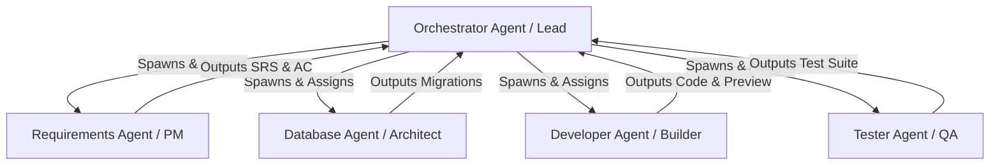

# 0.5 Multi-Agent Usage Guide - แนวทางการทำแผนงานและการทำงานแบบหลายเอเจนต์ (Multi-Agent Collaboration)

คู่มือนี้กำหนดระเบียบการทำงานร่วมกันระหว่าง AI Agents หลายตัว (Multi-Agent) ในการพัฒนาซอฟต์แวร์ตามมาตรฐาน E2E SDLC ของทีม เพื่อความปลอดภัย ประสิทธิภาพ และหลีกเลี่ยงข้อขัดแย้งเชิงโครงสร้าง (conflict)

---

## 📋 สารบัญ

1. [โครงสร้างบทบาทของเอเจนต์ (Agent Roles & Structure)](#โครงสร้างบทบาทของเอเจนต์-agent-roles--structure)
2. [ขั้นตอนการส่งต่องาน (Handover & Communication Protocol)](#ขั้นตอนการส่งต่องาน-handover--communication-protocol)
3. [การจัดการสถานะร่วมกัน (Shared State Management)](#การจัดการสถานะร่วมกัน-shared-state-management)
4. [การจัดการ Git & Branching สำหรับหลายเอเจนต์](#การจัดการ-git--branching-สำหรับหลายเอเจนต์)
5. [ข้อควรระวังและระบบป้องกัน (Critical Guardrails)](#ข้อควรระวังและระบบป้องกัน-critical-guardrails)

---

## โครงสร้างบทบาทของเอเจนต์ (Agent Roles & Structure)

ในการทำงานร่วมกัน เราจะแบ่งหน้าที่ของเอเจนต์เป็น 2 บทบาทหลักตามความชำนาญ:

### 1. Orchestrator Agent (Lead / Manager)
*   **หน้าที่หลัก:** เป็นจุดติดต่อหลักกับผู้ใช้ (User), วางแผนงานภาพรวม (Implementation Plan), ตรวจสอบความถูกต้องของแต่ละ Phase Gate, และควบคุมสิทธิ์การเขียนไฟล์หลัก
*   **ความรับผิดชอบ:**
    *   สร้างและอัปเดตไฟล์ [implementation_plan.md](file:///home/orin/.gemini/antigravity-ide/brain/afa5cced-bb59-442e-993b-1fdf9e3859ab/implementation_plan.md) และ [task.md](file:///home/orin/.gemini/antigravity-ide/brain/afa5cced-bb59-442e-993b-1fdf9e3859ab/task.md)
    *   สร้าง (spawn) สับเอเจนต์ (Subagents) พร้อมระบุขอบเขตงาน (Scope) และบริบท (Context) ที่ชัดเจน
    *   ตรวจสอบผลงานของสับเอเจนต์ก่อนทำการผสาน (merge/accept) เข้าสู่สาขาหลัก

### 2. Specialized Subagents (สับเอเจนต์เฉพาะทาง)
*   **PM / Requirements Agent:** จัดทำ User Stories, Acceptance Criteria (AC), และ MoSCoW ใน Phase 1
*   **Database Agent:** ออกแบบ Schema, ตรวจสอบ SQL Constraints, และทำ Migration ใน Phase 3
*   **Developer Agent (Builder):** พัฒนาโค้ด, ทำ Zod validation, สร้าง Component, และเปิด Local Preview ใน Phase 4
*   **Tester Agent (QA):** เขียนและรัน Unit/Integration Tests (Vitest, Supertest) เพื่อตรวจสอบ DoD ใน Phase 6

---

## ขั้นตอนการส่งต่องาน (Handover & Communication Protocol)

การส่งต่อบริบท (Context Handover) ที่ไม่สมบูรณ์เป็นสาเหตุหลักที่ทำให้เอเจนต์ทำงานซ้ำซ้อนหรือหลุดจากมาตรฐาน SOP ให้ใช้ระเบียบต่อไปนี้เสมอ:

### 1. การส่งต่องานจาก Orchestrator ไปยัง Subagent
เมื่อ Spawn Subagent จะต้องส่งพารามิเตอร์ดังนี้เสมอ:
- **Task Scope:** เป้าหมายและ Acceptance Criteria (AC) ที่ต้องทำให้ผ่าน
- **Input Files:** รายการไฟล์ที่เกี่ยวข้อง (เช่น Schema Doc สำหรับ Developer Agent)
- **Git Branch:** ชื่อสาขา (Branch) ที่ต้องใช้ทำงาน

### 2. การส่งต่องานกลับมาที่ Orchestrator
เมื่อ Subagent ทำงานเสร็จสิ้น จะต้องสรุปงานตามรูปแบบนี้:
- **Deliverables:** รายการไฟล์ที่สร้างหรือแก้ไขพร้อมลิงก์
- **Verification Results:** ผลการรัน Test หรือผลการทำ Local Preview
- **Next Steps:** ข้อเสนอแนะหรือสิ่งที่ต้องทำต่อไปในเฟสถัดไป

---

## การจัดการสถานะร่วมกัน (Shared State Management)

เอเจนต์ทุกตัวในระบบจะต้องใช้เอกสารแชร์เหล่านี้ร่วมกันเพื่อติดตามสถานะ (Single Source of Truth):

1.  **[implementation_plan.md](file:///home/orin/.gemini/antigravity-ide/brain/afa5cced-bb59-442e-993b-1fdf9e3859ab/implementation_plan.md):** แผนภาพรวมที่ได้รับการอนุมัติจากผู้ใช้ ห้าม Subagent แก้ไขโครงสร้างหลักของแผน เว้นแตได้รับคำสั่งจาก Orchestrator
2.  **[task.md](file:///home/orin/.gemini/antigravity-ide/brain/afa5cced-bb59-442e-993b-1fdf9e3859ab/task.md):** Checklist รายการย่อยที่กำลังทำ ให้ทำเครื่องหมาย `[/]` เมื่อเริ่มทำ และ `[x]` เมื่อเสร็จสิ้น

---

## การจัดการ Git & Branching สำหรับหลายเอเจนต์

เพื่อป้องกันการเขียนโค้ดทับซ้อนและ Git Conflict ให้ดำเนินงานตามระเบียบนี้:

1.  **แยกสาขาการทำงาน (Branch isolation):** 
    *   Orchestrator จะทำงานบน `main` หรือ `staging`
    *   Subagents จะต้องทำงานบนสาขาย่อยที่เจาะจง เช่น `feature/user-auth`, `feature/db-schema-refactor`, `bugfix/connection-leak`
2.  **ห้ามรันคำสั่ง Git Concurrent:** ห้ามสั่ง Git commit หรือ Git push พร้อมกันในเครื่องมือสั่งการเดียวกัน
3.  **Pull Updates เสมอ:** ก่อนสับเอเจนต์จะทำงานและหลังทำงานเสร็จ ให้ทำการดึงโค้ดล่าสุด (pull) เพื่อปรับปรุงสถานะโค้ดให้ตรงกัน

---

## ข้อควรระวังและระบบป้องกัน (Critical Guardrails)

> [!CAUTION]
> **กฎเหล็กเพื่อป้องกันความเสียหายต่อระบบและโค้ด:**
> 1. **ห้ามเขียนไฟล์เดียวกันพร้อมกัน (No Concurrent File Access):** เอเจนต์สองตัวห้ามแก้ไขไฟล์เดียวกันในเวลาเดียวกัน หากจำเป็นต้องทำ ให้ใช้วิธีต่อคิว (sequential execution)
> 2. **ห้ามแชร์ PostgreSQL Tokens ผ่าน Git:** API Token, Service Role Key, หรือรหัสผ่านฐานข้อมูล ห้ามแชร์ผ่านการสื่อสารแบบ plaintext หรือ push ลง git ให้ดึงค่าผ่าน Environment Variables เสมอ
> 3. **ควบคุมการรัน Migration อย่างระมัดระวัง:** การรันคำสั่ง `apply_migration` บน PostgreSQL จะต้องรันทีละไฟล์ตามลำดับของ Time-stamp และต้องได้รับการตรวจสอบจาก Database Agent เท่านั้น
> 4. **ตรวจสอบความขัดแย้งของโค้ด (Conflict Resolution):** หากมี Conflict เกิดขึ้นระหว่างการรวมงานของ Subagents ให้ Orchestrator เป็นผู้ทำการแก้ไข (resolve) เสมอ โดยอ้างอิงจาก Acceptance Criteria ใน Phase 1
