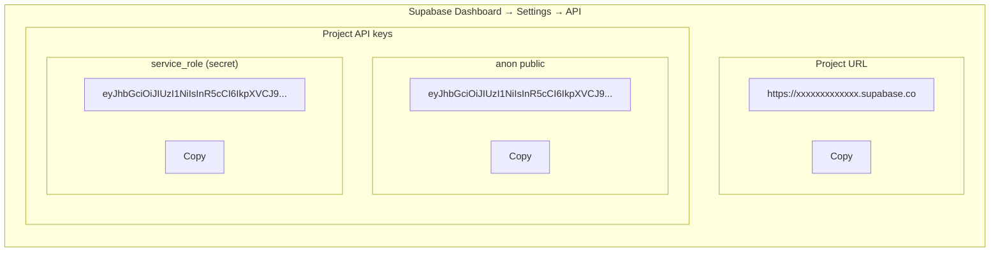

# 5.2 เตรียมตัวก่อน Deploy — Pre-Deploy Checklist

## วัตถุประสงค์

เอกสารนี้รวบรวมสิ่งที่ต้องเตรียมและตรวจสอบก่อนทำการ Deploy เพื่อให้การ Deploy สำเร็จในครั้งแรก

---

## 1. สิ่งที่ต้องมี (Prerequisites)

### 1.1 บัญชีและบริการ

| รายการ | คำอธิบาย | วิธีตรวจสอบ | สถานะ |
|--------|----------|-------------|-------|
| GitHub Account | บัญชี GitHub ที่เชื่อมต่อกับ Repository | เข้าสู่ระบบที่ [github.com](https://github.com) | ☐ |
| Railway Account | บัญชี Railway (สมัครฟรี) | สมัครที่ [railway.app](https://railway.app) | ☐ |
| Supabase Project | โปรเจกต์ Supabase พร้อม Database | มี URL และ API Keys | ☐ |
| Source Code | Code ที่พร้อม Deploy บน GitHub | Push code แล้ว | ☐ |

### 1.2 ข้อมูลที่ต้องเตรียม

เตรียมข้อมูลเหล่านี้ไว้ก่อน Deploy:

```
✅ Supabase URL: https://xxxxx.supabase.co
✅ Supabase Anon Key: eyJhbGciOiJIUzI1NiIs...
✅ Supabase Service Key: eyJhbGciOiJIUzI1NiIs...
✅ JWT Secret: (สร้างใหม่)
```

> **💡 Tip:** สร้างไฟล์ `.env.deploy` ไว้เก็บข้อมูลเหล่านี้ (อย่า commit ขึ้น GitHub!)

---

## 2. ตรวจสอบ Code ก่อน Deploy

### 2.1 ทดสอบ Build ใน Local

ก่อน Deploy ต้องแน่ใจว่า Code ทำงานได้ใน Local:

#### ทดสอบ Backend

```bash
# เข้าโฟลเดอร์ backend
cd backend

# ติดตั้ง dependencies
npm install

# Build โปรเจกต์
npm run build

# ทดสอบรัน
npm run start

# ✅ ต้องเห็น: Server is running on port 5001
```

#### ทดสอบ Frontend

```bash
# เข้าโฟลเดอร์ frontend (เปิด terminal ใหม่)
cd frontend

# ติดตั้ง dependencies
npm install

# Build โปรเจกต์
npm run build

# ทดสอบรัน production build
npx serve -s build

# ✅ ต้องเปิดเว็บได้ที่ http://localhost:3000
```

> **⚠️ ข้อควรระวัง:** ถ้า Build ไม่ผ่านใน Local จะไม่ผ่านบน Railway เช่นกัน ต้องแก้ไขให้เรียบร้อยก่อน!

> **🔒 commit `package-lock.json` + ทดสอบด้วย `npm ci` (ไม่ใช่แค่ `npm install`):** Railway build ด้วย `npm ci` ซึ่งอ่าน `package-lock.json` แบบเป๊ะ — ถ้า lockfile เก่า/ไม่ sync กับ `package.json` หรือลืม commit จะทำให้ build บน Railway พัง **ทั้งที่ `npm install` ผ่านบน local** (เพราะ `npm install` ยอมแก้ tree เอง แต่ `npm ci` ไม่ยอม). ทดสอบ local ด้วย `rm -rf node_modules && npm ci && npm run build` ก่อน push ทุกครั้ง

> **▶️ verify scripts `build` + `start` ทำงานจริง:** เปิด `package.json` ตรวจว่ามีทั้ง `build` และ `start` แล้วรันจริงใน local (`npm run build` → `npm run start`). สำหรับ **frontend** ที่ start ด้วย `serve` → package `serve` ต้องอยู่ใน `dependencies` (ไม่ใช่ `devDependencies`) เพราะ production start command เรียกใช้มัน (Railway ข้าม devDependencies ตอน `NODE_ENV=production`)

> **🔁 หลัง `git push` ต้อง verify config บน GitHub:** เปิด `package.json`, `tsconfig.json`, `nixpacks.toml` บน GitHub web UI แล้วเทียบกับไฟล์ local จริง — sandbox/editor mount บางครั้งอ่านไฟล์ที่เพิ่งแก้แบบ **ตัดท้าย/เพี้ยน** ทำให้บางบรรทัด (เช่น `skipLibCheck`, `lib`, `engines`) หล่นหายตอน push → build บน Railway พังทั้งที่ local ผ่าน

### 2.2 ตรวจสอบ TypeScript Errors

```bash
# Backend
cd backend
npx tsc --noEmit

# Frontend
cd frontend
npx tsc --noEmit
```

ถ้ามี errors ให้แก้ไขก่อน Deploy

---

## 3. ตรวจสอบไฟล์ Configuration

### 3.1 ไฟล์ที่ต้องมี

#### Backend Files

```
backend/
├── railway.toml          ✅ ต้องมี - ตั้งค่า Railway
├── nixpacks.toml         ✅ ต้องมี - ตั้งค่า Build environment
├── package.json          ✅ ต้องมี - มี scripts: build, start
├── tsconfig.json         ✅ ต้องมี - TypeScript config
└── src/
    └── server.ts         ✅ ต้องมี - Entry point
```

#### Frontend Files

```
frontend/
├── railway.toml          ✅ ต้องมี - ตั้งค่า Railway
├── package.json          ✅ ต้องมี - มี scripts: build
├── tsconfig.json         ✅ ต้องมี - TypeScript config
└── src/
    └── index.tsx         ✅ ต้องมี - Entry point
```

### 3.2 ตัวอย่าง railway.toml

#### Backend (`backend/railway.toml`)

```toml
[build]
builder = "nixpacks"

[deploy]
startCommand = "npm run start:simple"
healthcheckPath = "/api/health"
healthcheckTimeout = 100
restartPolicyType = "on_failure"
restartPolicyMaxRetries = 3
```

#### Frontend (`frontend/railway.toml`)

```toml
[build]
builder = "nixpacks"

[deploy]
startCommand = "npx serve -s build -l $PORT"
```

### 3.3 ตัวอย่าง nixpacks.toml

#### Backend (`backend/nixpacks.toml`)

```toml
[phases.setup]
nixPkgs = ["nodejs_22"]

[phases.install]
cmds = ["npm ci"]

[phases.build]
cmds = ["npm run build"]

[start]
cmd = "npm run start:simple"
```

> **💡 Tip:** ไฟล์ `nixpacks.toml` ช่วยให้ Railway รู้ว่าต้องใช้ Node.js เวอร์ชันไหนในการ Build
> **⚠️ ต้องใช้ Node 22+** (nixpkgs attr = `nodejs_22`, ไม่ใช่ `nodejs-18_x`) — Supabase SDK ใช้ native `WebSocket` ที่ Node 20 ไม่มี → `createClient()` crash ตอน boot. ตั้ง `engines.node` ใน `package.json` ควบคู่กันด้วย (nixpacks อ่าน major version จาก `engines`)

### 3.4 ตรวจสอบ package.json

#### Backend package.json - Scripts ที่ต้องมี

```json
{
  "scripts": {
    "build": "tsc",
    "start": "node dist/server.js",
    "start:simple": "node dist/server.js"
  },
  "dependencies": {
    "typescript": "^5.5.0",
    "tsx": "^4.16.0",
    "@types/node": "^20.0.0",
    "@types/express": "^4.17.0"
  },
  "engines": { "node": ">=22" }
}
```

> **⚠️ ข้อควรระวัง:** `typescript` **+ `tsx` + `@types/*`** ที่ build ต้องใช้ ต้องอยู่ใน `dependencies` **ไม่ใช่** `devDependencies` — Railway ตั้ง `NODE_ENV=production` แล้วข้าม devDependencies (ดู [5.6 §1](5.6_Troubleshooting.md#ปัญหาที่-1-build-failed)). `engines.node` = 22+ สำหรับ Supabase native WebSocket

#### Frontend package.json - Scripts ที่ต้องมี

```json
{
  "scripts": {
    "build": "react-scripts build"
  }
}
```

### 3.5 tsconfig.json — `lib` ต้องมี `"DOM"`

ถ้าใช้ `@supabase/*` (isomorphic SDK อ้างถึง `BroadcastChannel`, `Storage`, `WebSocket`) ต้องมี `"DOM"` ใน `compilerOptions.lib` และคง `skipLibCheck: true` ไว้ มิฉะนั้น build ผ่าน local แต่ fail บน Railway (ดู [4.1 §4](../04_DEVELOPMENT/4.1_Project_Initialization.md))

```json
{ "compilerOptions": { "lib": ["ES2022", "DOM"], "skipLibCheck": true } }
```

---

## 4. ตรวจสอบ Health Check Endpoint

Backend ต้องมี Health Check endpoint สำหรับ Railway:

```typescript
// src/routes/health.ts หรือ src/server.ts
app.get('/api/health', (req, res) => {
  res.json({
    status: 'ok',
    timestamp: new Date().toISOString()
  });
});
```

ทดสอบใน Local:

```bash
# รัน backend
npm run start

# ทดสอบ health check
curl http://localhost:5001/api/health

# ✅ ต้องได้: {"status":"ok","timestamp":"2025-12-15T..."}
```

---

## 5. วิธีหา Supabase Credentials

### 5.1 ขั้นตอน

1. เข้าสู่ระบบที่ [supabase.com](https://supabase.com)
2. เลือก Project ที่ต้องการ
3. ไปที่ **Settings** (ไอคอนเฟือง) → **API**
4. Copy ค่าต่อไปนี้:

| ชื่อใน Supabase | ใช้เป็น Environment Variable |
|-----------------|------------------------------|
| Project URL | `SUPABASE_URL` (backend) |
| service_role | `SUPABASE_SERVICE_ROLE_KEY` (backend เชื่อมต่อด้วย key นี้) |
| anon public | `VITE_SUPABASE_ANON_KEY` / `NEXT_PUBLIC_SUPABASE_ANON_KEY` (เฉพาะ frontend ที่เรียก Supabase ตรง) |

### 5.2 ภาพตัวอย่าง



**ตำแหน่งที่หา Credentials:**

| ข้อมูล | ตำแหน่งใน Supabase Dashboard |
|--------|------------------------------|
| Project URL | Settings → API → Project URL |
| anon public | Settings → API → Project API keys → anon public |
| service_role | Settings → API → Project API keys → service_role (secret) |

> **⚠️ ข้อควรระวัง:**
> - `service_role` key มีสิทธิ์สูงมาก **ห้ามเปิดเผยต่อสาธารณะ!** — ใช้ฝั่ง backend เท่านั้น ห้าม prefix `VITE_`/`REACT_APP_`/`NEXT_PUBLIC_`
> - อย่า Commit keys ลงใน Code หรือ GitHub

---

## 6. วิธีสร้าง JWT Secret

JWT Secret ใช้สำหรับ sign และ verify JWT tokens ต้องเป็นค่าที่ซับซ้อนและเก็บเป็นความลับ

### 6.1 วิธีสร้าง

#### macOS/Linux

```bash
openssl rand -base64 32
```

#### Windows (PowerShell)

```powershell
[Convert]::ToBase64String((1..32 | ForEach-Object { Get-Random -Maximum 256 }) -as [byte[]])
```

#### ใช้ Node.js

```bash
node -e "console.log(require('crypto').randomBytes(32).toString('base64'))"
```

### 6.2 ตัวอย่างผลลัพธ์

```
K7gNU3sdo+OL0wNhqoVWhr3g6s1xYv72ol/pe/Unols=
```

> **💡 Tip:**
> - ใช้ค่าที่ซับซ้อนอย่างน้อย 32 characters
> - สร้างค่าใหม่สำหรับ Production (อย่าใช้ค่าจาก Development)

---

## 7. Checklist ก่อน Deploy

### 7.1 บัญชีและบริการ

- [ ] มี GitHub Account และ login แล้ว
- [ ] มี Railway Account และ login แล้ว
- [ ] มี Supabase Project และใช้งานได้
- [ ] Push code ล่าสุดขึ้น GitHub แล้ว

### 7.2 ไฟล์ Configuration

- [ ] มี `backend/railway.toml`
- [ ] มี `backend/nixpacks.toml`
- [ ] มี `frontend/railway.toml`
- [ ] `typescript` + `tsx` + `@types/*` อยู่ใน dependencies (ไม่ใช่ devDependencies)
- [ ] `tsconfig.json` `lib` มี `"DOM"` + `skipLibCheck: true` (ถ้าใช้ `@supabase/*`)
- [ ] `nixpacks.toml` (`nodejs_22`) + `package.json` `engines.node` = 22+
- [ ] หลัง push: เปิดดู `package.json` / `tsconfig.json` / `nixpacks.toml` บน GitHub เทียบกับ local จริง (กันบรรทัดหล่นหาย)

### 7.3 Code Quality

- [ ] `npm run build` ผ่านทั้ง Frontend และ Backend
- [ ] ทดสอบ `npm ci` (ลบ node_modules ก่อน) ผ่าน + commit `package-lock.json` ที่ sync แล้ว
- [ ] `package.json` มี scripts `build` + `start` และรันจริงผ่าน (frontend: `serve` อยู่ใน dependencies)
- [ ] ไม่มี TypeScript errors
- [ ] Health check endpoint ทำงานได้

### 7.4 Credentials พร้อม

- [ ] มี Supabase URL
- [ ] มี Supabase Service Role Key (backend เชื่อมต่อด้วย key นี้)
- [ ] (เฉพาะถ้ามี frontend เรียก Supabase ตรง) มี Supabase Anon Key
- [ ] สร้าง JWT Secret แล้ว

---

## 8. ขั้นตอนถัดไป

เมื่อเตรียมตัวครบแล้ว ให้ไปที่:

➡️ **[5.3 Environment Variables](5.3_Environment_Variables.md)** — ตั้งค่า Environment Variables

---

## Quick Reference

### คำสั่งทดสอบก่อน Deploy

```bash
# Backend
cd backend && npm install && npm run build && npm run start

# Frontend (terminal ใหม่)
cd frontend && npm install && npm run build && npx serve -s build

# Test health check
curl http://localhost:5001/api/health
```

### สร้าง JWT Secret

```bash
# macOS/Linux
openssl rand -base64 32

# Node.js
node -e "console.log(require('crypto').randomBytes(32).toString('base64'))"
```

---

**จัดทำโดย:** ทีมพัฒนา Kaizen Web Application
**วันที่อัปเดต:** 14 มิถุนายน 2026
