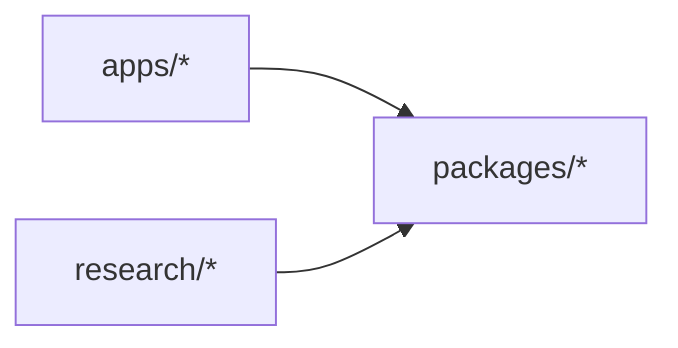

# 01 · Monorepo Structure

## วัตถุประสงค์

วางโครงสร้าง repository ของ AI Application เป็น **uv workspace monorepo** สามส่วน:

- `packages/` — **library ส่วนกลาง** ที่ทุก app เรียกใช้
- `apps/` — **microservice** แต่ละตัวแยกขาด รันได้ด้วยตัวเอง
- `research/` — **พื้นที่ทดลอง** แยกตามหัวข้อ

repo เดียว lockfile เดียว แต่ขอบเขตชัด

---

## 1. โครงสร้าง

```text
<repo>/
├── packages/                      # library ส่วนกลาง
│   └── <pkg-name>/
│       ├── pyproject.toml         # build-backend = uv_build
│       ├── README.md
│       ├── src/<pkg_name>/        # domain + inference logic, py.typed
│       └── tests/unit_tests/
├── apps/                          # microservices — แยกขาด รันเดี่ยวได้
│   ├── backend/                   # FastAPI — Clean Architecture (ดู 02)
│   ├── frontend/                  # React + TS ตาม ../../SKILL.md
│   ├── mqtt/                      # edge controller: PLC, กล้อง, event dispatch
│   └── <worker>/                  # worker เฉพาะทาง เช่น ocr, detection
│       ├── Dockerfile
│       ├── pyproject.toml
│       ├── README.md
│       ├── .env.example
│       ├── src/<module>/
│       └── tests/
├── research/                      # หัวข้อวิจัย (ดู 04)
│   ├── ocr/                       # หัวข้อ: พัฒนา model OCR
│   │   ├── paddleocr/             #   approach
│   │   └── glm-ocr/               #   approach
│   └── apperances/                # หัวข้อ: ตรวจลักษณะภายนอก
│       ├── template-matching/
│       ├── anomaly-detection/
│       ├── object-detection/
│       ├── linear-optimization/
│       └── agentic-pipeline/
├── docker/                        # infra: compose ของ DB, broker, seed SQL
├── docs/                          # architecture, guides, reference (MkDocs)
├── packages/dataset.dvc           # DVC pointer — ข้อมูลจริงอยู่ใน remote
├── .env.example                   # ทุก env key พร้อมค่า default ที่ปลอดภัย
├── docker-compose.yml             # stack รวมทุก service
├── pyproject.toml                 # workspace root: [tool.uv] package = false
├── Taskfile.yml                   # go-task: ทุกคำสั่งที่ใช้ซ้ำ
└── uv.lock                        # lockfile เดียวของทั้ง workspace
```

## 2. ทิศทาง dependency (DAG)



| จาก | import ได้ | ห้าม import |
|---|---|---|
| `apps/<a>` | `packages/*` | `apps/<b>` (คุยผ่าน HTTP / MQTT / DB เท่านั้น), `research/*` |
| `packages/<p>` | `packages/*` ที่ประกาศใน `pyproject.toml` | `apps/*`, `research/*` |
| `research/*` | `packages/*` | `apps/*`, approach อื่น (ให้ copy แทน) |

บังคับด้วย import-linter (`forbidden` contract) ใน root `pyproject.toml`:

```toml
[tool.importlinter]
root_packages = ["app", "mqtt_service", "inspection_domain", "battery_ocr"]
include_external_packages = true

[[tool.importlinter.contracts]]
name = "packages/* never import apps/*"
type = "forbidden"
source_modules = ["inspection_domain", "battery_ocr"]
forbidden_modules = ["app", "mqtt_service"]

[[tool.importlinter.contracts]]
name = "apps are isolated from each other"
type = "independence"
modules = ["app", "mqtt_service"]
```

รัน: `uv run lint-imports` (ใส่ไว้ใน `task check-boundaries`)

## 3. apps — microservice ที่แยกขาด

app แต่ละตัวต้องผ่านทุกข้อ:

- [ ] มี `pyproject.toml`, `Dockerfile`, `README.md`, `.env.example` (key ของ app นี้), `tests/` ของตัวเอง
- [ ] รัน test ได้เดี่ยว ๆ: `uv run --package <app> pytest`
- [ ] start ได้เดี่ยว ๆ: `docker compose up <service>` (dependency ภายนอกอย่าง DB หรือ broker มาจาก compose)
- [ ] ไม่ import app อื่น — การคุยข้าม app ใช้ HTTP, MQTT topic หรือ DB ผ่าน `adaptor/<system>/`
- [ ] deploy แยกได้: rebuild แค่ service นี้ (`docker compose up -d --no-deps --build <service>`)
- [ ] app ที่เป็น Python ใช้โครง Clean Architecture ตาม `7.2_Clean_Architecture_Backend.md`
- [ ] app บาง: business logic ที่ใช้ซ้ำได้อยู่ใน `packages/` app เก็บแค่ wiring, use case เฉพาะตัว และ adaptor

**contract ข้าม app:** เมื่อ app หนึ่งเปลี่ยน payload ที่ app อื่นใช้ (route, MQTT message, ตาราง) ใช้ *Expand → Migrate → Contract* — เพิ่ม field ใหม่แบบ optional, ย้าย consumer, แล้วค่อยลบ field เก่า

## 4. packages — library ส่วนกลาง

package เกิดจาก app: logic ถูกเขียนครั้งแรกใน app ที่ต้องใช้ เมื่อ **app ที่สอง** ต้องใช้ logic เดียวกัน ให้ย้ายเข้า `packages/` แล้วให้ทั้งสอง app เรียกจากที่นั่น

ขั้นตอนย้าย logic จาก app เข้า package:

1. แตก branch `packages/<pkg-name>`
2. `uv init --package packages/<pkg-name>` (src layout + `py.typed`)
3. ย้ายโค้ดพร้อม test เข้า `src/<pkg_name>/` และ `tests/unit_tests/` — ตัดการพึ่ง framework ของ app ทิ้ง (FastAPI, psycopg, MQTT client)
4. ผูกเข้า app: `uv add --package <app> <pkg-name>` (uv เขียน `[tool.uv.sources] <pkg-name> = { workspace = true }` ให้เอง)
5. ลบโค้ดเดิมออกจาก app แล้ว import จาก package แทน — ห้ามเหลือสองชุด
6. เพิ่ม package ใน import-linter `forbidden` contract และใน Dockerfile ของทุก app ที่ใช้

ตัวอย่างการเรียกจาก app (import module ตาม house rule):

```python
from inspection_domain import battery_code

match = battery_code.search_battery_code(label_type, raw_text)
```

## 5. คำสั่ง uv

```bash
uv init --package packages/<pkg-name>          # package ใหม่ (src layout)
uv add --package <member> <dependency>         # dependency ของ member
uv add --package <member> --dev pytest         # dev dependency
uv run --package <member> pytest               # รันใน context ของ member
uv sync --all-packages                         # ติดตั้งทุก member ลง .venv ของ root
```

- ห้ามแก้รายการ dependency ใน `pyproject.toml` / `uv.lock` ด้วยมือ และห้ามใส่ runtime dependency ที่ root
- ใช้ `src/<module>/` layout เสมอ เพื่อไม่ให้ชื่อ module ชนกัน
- ชื่อ distribution เป็น `kebab-case` (`battery-ocr`), ชื่อ import เป็น `snake_case` (`battery_ocr`)
- ห้ามใช้ `pip install` ใน script หรือ docs

## 6. Dockerfile (workspace pruning)

```dockerfile
FROM docker.io/library/python:3.13-slim
WORKDIR /workspace
COPY --from=ghcr.io/astral-sh/uv:latest /uv /bin/
COPY pyproject.toml uv.lock ./
# packages ที่ app นี้ใช้: copy ทั้ง folder
COPY packages/inspection-domain/ ./packages/inspection-domain/
# member อื่นของ workspace: copy แค่ pyproject.toml ให้ --frozen ตรวจ lockfile ผ่าน
COPY packages/segmentation/pyproject.toml ./packages/segmentation/pyproject.toml
COPY apps/mqtt/pyproject.toml ./apps/mqtt/pyproject.toml
COPY apps/backend/pyproject.toml ./apps/backend/pyproject.toml
COPY apps/backend/src ./apps/backend/src
RUN uv sync --frozen --no-dev --no-editable --package gs-backend
ENV PATH="/workspace/.venv/bin:$PATH"
CMD ["uvicorn", "app.main:app", "--host", "0.0.0.0", "--port", "8000"]
```

- `--package` ติดตั้งเฉพาะ dependency tree ของ app นั้น การเปลี่ยน dependency ของ app อื่นจึงไม่ทำให้ layer cache เสีย
- **กับดัก:** `--frozen` ต้องเห็น `pyproject.toml` ของ **ทุก** member ใน workspace ถ้าเพิ่ม member ใหม่ ต้องเพิ่มบรรทัด `COPY .../pyproject.toml` ใน Dockerfile ของทุก app
- ทุก service ต้องรันได้จาก `docker-compose.yml` ที่ root (DoD ข้อ 7 ของ SOP เว็บ)
- เครื่องเดียวที่มีทั้ง dev และ prod: deploy ทีละ service ห้ามหยุด GPU model server หรือ DB ของ production

## 7. Dataset และ weights (DVC)

- ไฟล์ dataset, รูปภาพจำนวนมาก, model weights ห้ามเข้า git — track ด้วย `dvc add` แล้ว commit แค่ไฟล์ `.dvc`
- ดึงข้อมูล: `dvc pull` · credentials ของ remote เก็บใน `.dvc/config.local` หรือ env var ห้าม commit
- อ้างถึงข้อมูลด้วย **dataset version** (git commit ของไฟล์ `.dvc`) ทุกครั้งที่รายงานตัวเลข

## 8. Config และ secret

- `.env.example` (อยู่ใน git) คือ source of truth ของทุก key; `.env` จริงอยู่นอก git
- เพิ่ม env var ใหม่ → เพิ่มใน `.env.example` พร้อม comment และค่า mock ในการเปลี่ยนแปลงเดียวกัน
- อ่านผ่าน `pydantic_settings.BaseSettings` ใน `config.py` ของแต่ละ app โดยมีค่า default ให้รันได้ทันที

## 9. Branch และ PR (GitLab Flow)

- งานทุกชิ้นเริ่มจาก branch สั้น ๆ ที่แตกจาก `main` ล่าสุด — **แตก branch ก่อนเขียนไฟล์แรกเสมอ** โดยเฉพาะ experiment ใหม่, app ใหม่ และ package ใหม่
- ตั้งชื่อ: `research/<topic>-<slug>` · `apps/<app-name>` · `packages/<pkg-name>` · `feat/<slug>` · `fix/<slug>` · `refactor/<slug>`
- merge เข้า `main` ผ่าน PR ที่ review แล้วและ CI ผ่านเท่านั้น ห้าม push หรือ merge เข้า `main` ตรง ๆ
- flow ลงล่างอย่างเดียว: `feature → main → staging → production`; hotfix แก้ที่ `main` ก่อนแล้วค่อย cherry-pick ลง
- ผูก branch และ PR กับ issue ID ของ tracker
- ก่อนเปิด PR: รัน test ทั้ง workspace (`task test`) ไม่ใช่แค่ member ที่แก้

---

[กลับไป INDEX](INDEX.md)
